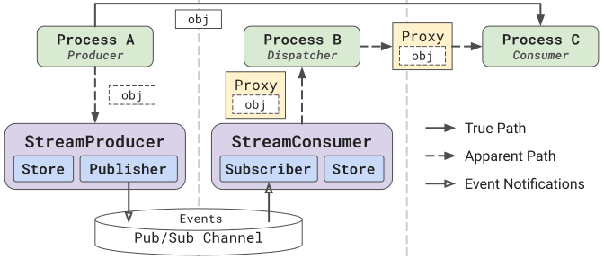

# Streaming Objects with ProxyStore

*Last updated 29 January 2024*

This guide describes the motivation for and usage of ProxyStore's
streaming interface.

!!! note

    Some familiarity with ProxyStore is assumed. Check out the
    [Get Started](../get-started.md){target=_blank} guide and
    [Concepts](../concepts/index.md){target=_blank} page to learn more about
    ProxyStore's core concepts.

The [`StreamProducer`][proxystore.stream.StreamProducer]
and [`StreamConsumer`][proxystore.stream.StreamConsumer] interfaces decouple
bulk object communication from event notifications through the use of
object proxies. This enables users to mix and match bulk object communication
methods (via the [`Connector`][proxystore.connectors.protocols.Connector]
interface) and event streaming methods (via the
[`Publisher`][proxystore.stream.protocols.Publisher] and
[`Subscriber`][proxystore.stream.protocols.Subscriber] interfaces).
Additionally, because the [`StreamConsumer`][proxystore.stream.StreamConsumer]
yields proxies of objects from the stream, bulk data transfer only occurs
between the source and *true* destination of the object from the stream
(i.e., the process which *resolves* the proxy from the stream).

## Use Cases

The ProxyStore streaming interface can be used anywhere where one process
needs to stream objects to another process, and the interface can be used
to optimize the deployment via different
[`Connector`][proxystore.connectors.protocols.Connector] and
[`Publisher`][proxystore.stream.protocols.Publisher]/
[`Subscriber`][proxystore.stream.protocols.Subscriber] implementations.

But, this model is particularly powerful for applications which dispatch
remote compute tasks on objects consumed from a stream.
To understand why, consider the
application in **Figure 1** where *Process A* is a data generator streaming
chunks of data (i.e., arbitrary Python objects) to *Process B*, a dispatcher
which dispatches a compute task on a remote *Process C* using the data
chunk.

{ width="100%" }
> <b>Figure 1:</b> ProxyStore Streaming example.

In this scenario, while the dispatcher is consuming from the stream,
the dispatcher does not need to have the actual chunk of data; rather,
it only needs to know that a chunk is ready in order to dispatch a task
which will actually consume the chunk. This is where a stream of proxies
is beneficial---the processes reading from the
[`StreamConsumer`][proxystore.stream.StreamConsumer] is receiving lightweight
proxies from the stream and passing those proxies along to later
computation stages. The bulk data are only transmitted between the data
generator and the process/node computing on the proxy of the chunk, bypassing
the intermediate dispatching process.

## Example

Here is an example of using the
[`StreamProducer`][proxystore.stream.StreamProducer]
and [`StreamConsumer`][proxystore.stream.StreamConsumer] interfaces
to stream objects using a file system and Redis server.
This configuration is optimized for storage of large objects using the
file system while maintaining low latency event notifications via Redis
pub/sub. However, the configuration can easily be optimized for different
applications or deployments but using a different
[`Connector`][proxystore.connectors.protocols.Connector] with the
[`Store`][proxystore.store.base.Store] for data storage and/or a different
[`Publisher`][proxystore.stream.protocols.Publisher]/
[`Subscriber`][proxystore.stream.protocols.Subscriber] implementation for
event notifications.

```python title="producer.py" linenums="1"
from proxystore.connector.file import FileConnector
from proxystore.store import Store
from proxystore.stream import StreamProducer
from proxystore.stream.shims.redis import RedisPublisher

store = Store('example', FileConnector(...)) # (1)!
publisher = RedisPublisher(...) # (2)!

producer = StreamProducer(store, publisher)

for item in ...:
    producer.send(item, evict=True) # (3)!

producer.close() # (4)!
```

1. The [`Store`][proxystore.store.base.Store] configuration is the same
   on the producer and consumer side. Consider using different
   [`Connector`][proxystore.connectors.protocols.Connector] implementations
   depending on your deployment or data characteristics.
2. The [`Publisher`][proxystore.stream.protocols.Publisher] is the interface
   to a pub/sub channel which will be used for sending event metadata to
   consumers.
3. The state of the `evict` flag will alter if proxies yielded by a
   consumer are one-time use or not.
4. Closing the [`StreamProducer`][proxystore.stream.StreamProducer] will close
   the [`Publisher`][proxystore.stream.protocols.Publisher],
   [`Store`][proxystore.store.base.Store], and
   [`Connector`][proxystore.connectors.protocols.Connector] by default. Closing
   the [`Publisher`][proxystore.stream.protocols.Publisher] sends a special
   event type to the stream that signals and consumers to raise a
   [`StopIteration`][StopIteration] exception signaling the end
   of the stream.

```python title="consumer.py" linenums="1"
from proxystore.connector.file import FileConnector
from proxystore.proxy import Proxy
from proxystore.store import Store
from proxystore.stream import StreamConsumer
from proxystore.stream.shims.redis import RedisSubscriber

store = Store('example', FileConnector(...))  # (1)!
subscriber = RedisSubscriber(...)  # (2)!

consumer = StreamConsumer(store, subscriber)

for item in consumer: # (3)!
    assert isinstance(item, Proxy)  # (4)!

consumer.close() # (5)!
```

1. The [`Store`][proxystore.store.base.Store] configuration is the same
   on the producer and consumer side. Consider using different
   [`Connector`][proxystore.connectors.protocols.Connector] implementations
   depending on your deployment or data characteristics.
2. The [`Subscriber`][proxystore.stream.protocols.Subscriber] is the interface
   to the same pub/sub channel that the producer is publishing event metadata
   to. These events are consumed by the
   [`StreamConsumer`][proxystore.stream.StreamConsumer] and used to
   generate proxies of the objects in the stream.
3. Iterating on a [`StreamConsumer`][proxystore.stream.StreamConsumer] will
   block until new proxies are available and yield those proxies. Iteration
   will stop once the [`Publisher`][proxystore.stream.protocols.Publisher]
   is closed via the [`StreamProducer`][proxystore.stream.StreamProducer].
4. The yielded proxies point to objects in the
   [`Store`][proxystore.store.base.Store], and the state of the `evict` flag
   inside the proxy's factory is determined in
   [`StreamProducer.send()`][proxystore.stream.StreamProducer.send].
4. Closing the [`StreamConsumer`][proxystore.stream.StreamConsumer] will close
   the [`Subscriber`][proxystore.stream.protocols.Subscriber],
   [`Store`][proxystore.store.base.Store], and
   [`Connector`][proxystore.connectors.protocols.Connector] by default.

## Multi-Producer/Multi-Consumer

The [`StreamProducer`][proxystore.stream.StreamProducer]
and [`StreamConsumer`][proxystore.stream.StreamConsumer] can support
multi-producer and multi-consumer deployments, respectively.
However, it is *not* a requirement that the
[`Publisher`][proxystore.stream.protocols.Publisher] or
[`Subscriber`][proxystore.stream.protocols.Subscriber] protocols to
implements multi-producer or multi-consumer support.
In other words, it is up to each
[`Publisher`][proxystore.stream.protocols.Publisher]/
[`Subscriber`][proxystore.stream.protocols.Subscriber] implementation
to decide on and document their support for these features, and users
should confirm that the specific implementations or configurations parameters
produce the behavior they want.

**Multi-producer.** If a [`Publisher`][proxystore.stream.protocols.Publisher]
supports multiple producers, typically no changes are required on
when initializing the corresponding
[`StreamProducer`][proxystore.stream.StreamProducer]. Each producer process
can simply initialize the [`Publisher`][proxystore.stream.protocols.Publisher]
and [`StreamProducer`][proxystore.stream.StreamProducer] and begin sending
objects to the stream.

**Multi-consumer.** If a [`Subscriber`][proxystore.stream.protocols.Subscriber]
support multiple consumers, attention should be given to the manner in which
the consumers behave. If all consumers receive the full stream (i.e., each
consumer receives each object in the stream), then the the `evict` flag of
[`StreamProducer.send()`][proxystore.stream.StreamProducer.send] should be
set to `False`. This ensures that the first consumer to resolve a proxy from
the stream does not delete the object data for the other consumers, but
this also means that object cleanup must be handled manually by the
application. Otherwise, the store will fill up with the entire stream of
objects. On the other hand, if each object in the stream is only received by
one consumer, then it *may* be safe to set `evict=True`.
